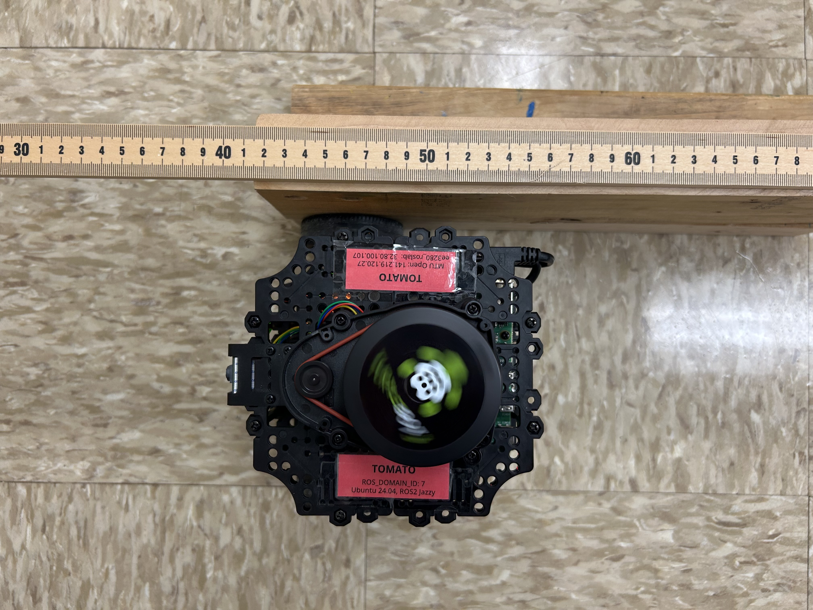
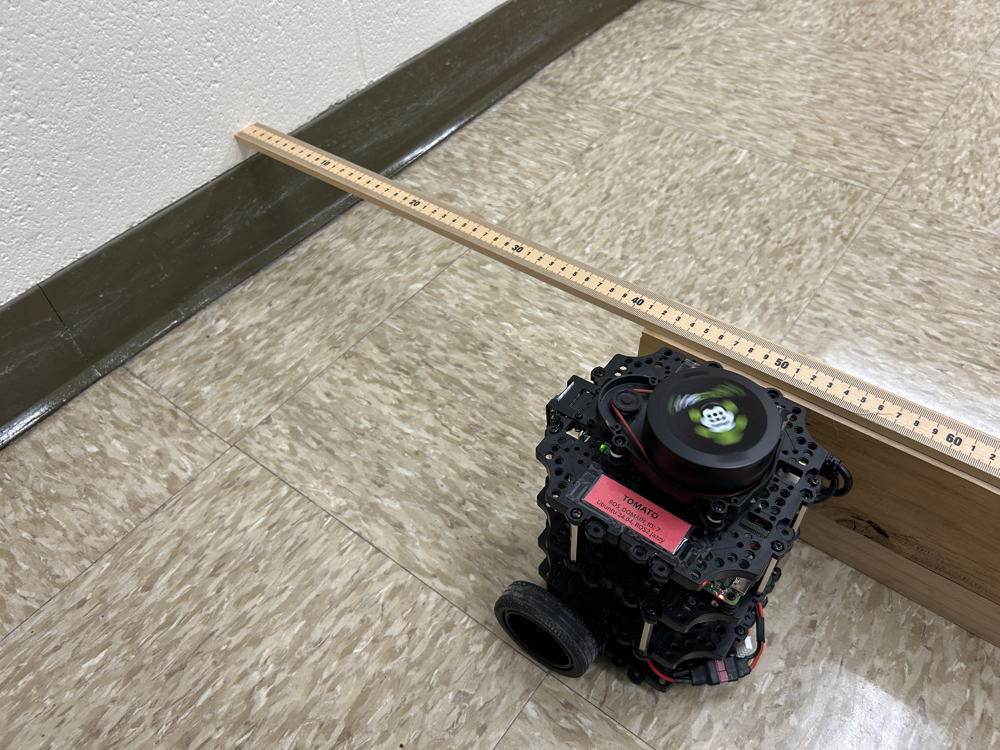
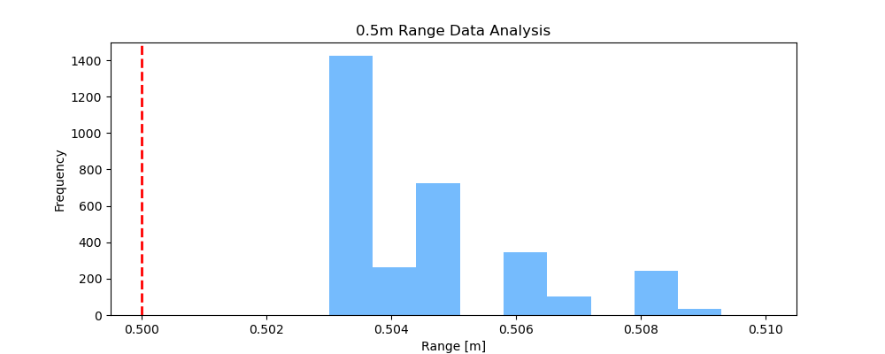
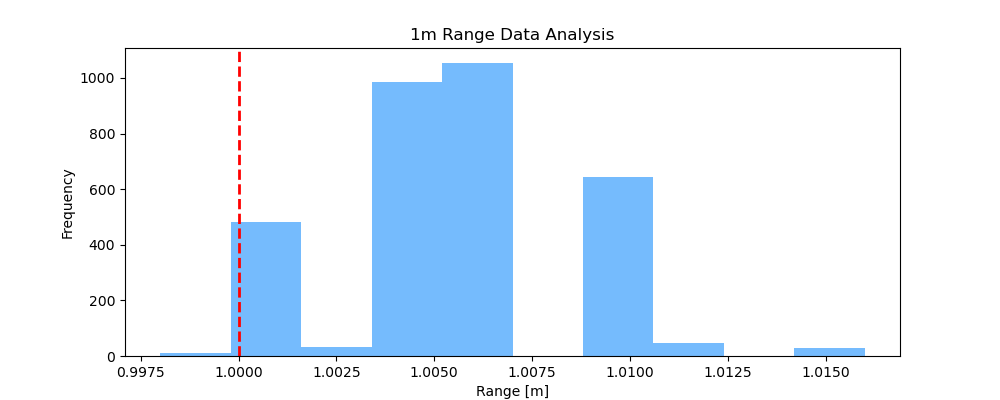
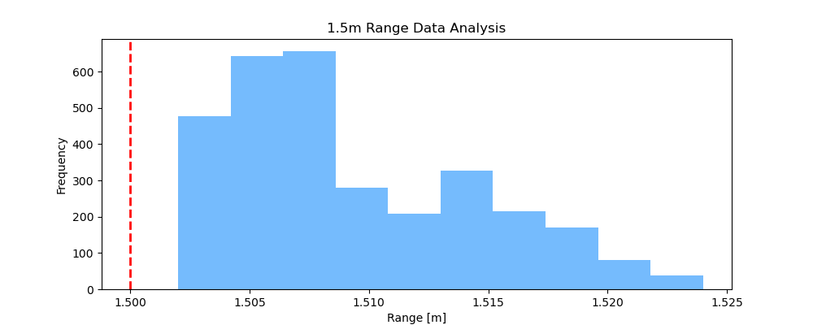
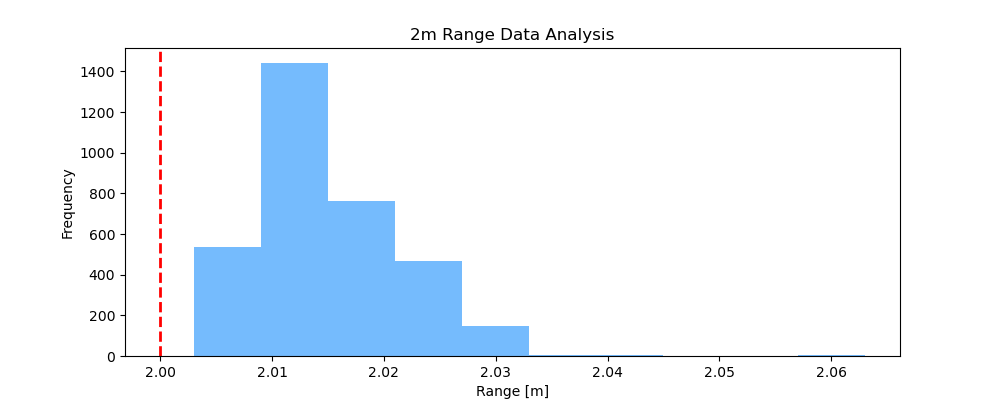

# Project 5 Lidar Calibration 
### Michigan Tech EE5531 Intro to Robotics ###
<u>Group 2</u>: Reid Beckes + Ian Mattson

## 1. Introduction + Methodology

### Brief description of the Beam Model and calibration approach
In Probabilistic Robotics, Thrun describes a Beam Model for range measurements that includes measurement noise, unexpected short readings, maximum range readings, and random readings as four key noise sources experienced by a range finder [1]. 

By estimating intrinsic parameters outlined in the Beam Model, one can account for sources of error in a range measurement by leveraging the instrinsics as calibration parameters.  In the project, we focus on the sensor's range precision, $\sigma_{hit}$.

### Data Collection Procedure
To collect calibration data for this project, the [Turtlebot3 Burger's LDS-02 Laser Scanner](https://emanual.robotis.com/docs/en/platform/turtlebot3/appendix_lds_02/) recorded range data via the Turtlebot's ROS2 driver.

The Turtlebot was aligned at four distances to the wall at the front of the room under the whiteboard. Care was taken to ensure the center of the lidar was aligned with the desired distance, illustrated in Figure 1. The Turtlebot was aligned such that the forward direction, and thus $0\degree$, range data, was perpendicular to the wall being measured.  Data was collected at 0.5m, 1m, 1.5m, and 2m from the wall.

Approximately 30 seconds of data was collected via `ros2 bag record`, saving all LaserScan messages on the `/scan` topic. These bags are located in the [/data/ directory](/data/).

Figure 1: Aligning the center of the Turtlebot laser scanner to the target distance, 50 cm (0.5 m) in this example.

### Challenges Encountered
During the initial data collection procedure, we discovered that if we place the reference meter stick on the floor, it would have a small offset due to the trim on the wall in Figure 2. The turtlebot's laser scanner is tall enough that it measures the wall above the trim line.

Therefore, we adjusted by using scrap wood in EERC 722 to elevate the meter stick above the trim to avoid the offset from the trim.  

Figure 2: Elevated meter stick to get a more accurate distance reading from the laser scanner to the wall, avoiding the trim.

## 2. Histogram Analysis

In the following histogram analysis, all laser beams $\pm 5\degree$ the forward direction, $0\degree$, are considered.  This FoV corresponds to 11 distinct laser measurements per scan message, and with approximately 300 messages per bag, there are ~3300 individual range measurements accumulated for the historgram analysis.

### Histograms by Target Distance

For each target distance tested, a histogram of range measurements is plotted with a vertical line of the expected target distance.

Figure 3 illustrates the ranges histogram at the 0.5m tested distance. The measured range distribution at 0.5m distance has a right-skewed distribution with the majority of range measurements between 0.503m and 0.504m, with outliers at increased distance.  All measurements were within 1 cm from the expected distance, but no measurements were at the expected 0.5m range.

Figure 3: 0.5m target distance range histogram, vertical striped line at 0.5m indicating true target range

Figure 4 illustrates the ranges histogram at the 1m tested distance.  The range distribution takes the form of a multimodal distribution, and has some resembelance with the sinc() function. The majority of measurements lie between 1.0025m and 1.0075m, but there are notable spikes at approximately 1m and 1.01m.

Figure 4: 1m target distance range histogram, vertical striped line at 1m indicating true target range

Figure 5 highlights the histogram of range data for the 1.5m tested distance. This data takes the form of a right-skewed distribution, with most data occuring between 1.5m and 1.51m, but the right tail extends out past 1.52m.

Figure 5: 1.5m target distance range histogram, vertical striped line at 1.5m indicating true target range

Figure 6 illustrates the histogram for the final tested distance at 2m. This data is the closest to gaussian-shaped, but has very few outliers on the right tail.  Nearly all data is between 2m and 2.035m, but outliers exist out to 2.06m.

Figure 6: 2m target distance range histogram, vertical striped line at 2m indicating true target range

### Beam Error Model Noise Sources

The Beam Error model considers four noise sources - measurement noise, unexpected short readings, max range readings, and random readings. In the collected data, the most consistent noise source observed is the measurement noise, although the noise itself does not match the gaussian description by Thrun [1].

Some Nan (not a number) values were observed and had to be filtered out to perform histogram plotting, indicating an issue with a reading being out of range (too close or too far), or a missing return.  Given that the Nan values are very inconsistent, I do not suspect them to be caused by an out of range error, and our data therefore does not support noise sources from maximum readings or unexpectedly close objects. The Nan values are fairly random though, and are considered to be parts of the random readings noise source as described by Thrun.

## 3. Parameter Estimation and Results

### Table of estimated parameters for each distance
| Target Range [m] | $\sigma_{hit}$ [m] | Bias [m] |
|---|---|---|
| 0.5 | 0.00476 | 0.00446 |
| 1.0 | 0.00663 | 0.00594 |
| 1.5 | 0.01065 | 0.00936 |
| 2.0 | 0.01619 | 0.01464 |

### Analysis of how σ_hit varies with distance

As distance increases, $\sigma_{hit}$ increases as well.  This is evidence that laser measurement values experience heteroskedasticity, where variance of measurement error is not constant but rather increases as distance increases.

### Proposed uncertainty model with justification (e.g., σ_hit = σ_0 + σ_1·z)

From our collected data, we do not see strong influences as a result of unexpected short readings or max range readings in the limited test case of 0.5m - 2m. However, measurement noise is present and should be weighted more heavily in the Beam model. Additionally, some random readings manifesting as Nan values were present, and should be weighted more than the max and short noise sources.

We propose the following weights, $z$, according to the effects seen in our collected data for the combined Thrun Beam Model:
| Weight | Value |
| --- | --- |
| $z_{hit}$ | 0.8 |
| $z_{short}$ | 0.05 |
| $z_{max}$ | 0.05 | 
| $z_{rand}$ | 0.1 |

### Discussion of outlier rates and beam model mixing weights

As the most variation observed in our data occured during normal range measurements within the operating range of the sensor, and there were no unexpected short readings, those noise components are weighted the lowest at 0.05 each.  We saw a few random readings, so random noise sources are weighted slightly higher at 0.1.  The most of our noise was due to measurement noise, which gets the highest weight at 0.8.

## 4. Analysis Questions

### Does the measurement distribution match the Gaussian assumption of p_hit?

No, in our four distance scenarios we did not see evidence that the distribution was Gaussian.  Often we saw right-skewed histograms with most of the range measurements on the left, and a long tail on the right.  Perhaps given greater range, we may see more gaussian shaped noise, but from distances of 0.5m to 2m, the noise does not support the Gaussian assumption.

### How does measurement uncertainty vary with distance?
As measurement distance increases, the measurement uncertaintly also increases.  This is known as heteroskedasticity, where the range variance is not constant as a function of distance, but instead increases with distance.

### Were there systematic biases? How would you correct for them?

The table in section 3 indicates that there was bias of approximately 0.5 cm for the measurements from 0.5m and 1m ranges, a bias of approximately 1 cm for the 1.5m range, and the greatest bias of approximately 1.5 cm for the 2m range target. 

To correct for these biases, a consistent and calibrated reference alignment should be used to align the Turtelbot's laser scanner with the desired measurement.  This would help minimize operator error in placing the Turtlebot a set distance from the wall.

## 5. Usage Instructions

### Build instructions for your ROS2 package

### How to run the calibration node with parameters

### How to run the offline analysis script

### Example commands and expected output

## References

[1] Thrun, S., Burgard, W., & Fox, D. (2005). Probabilistic Robotics. MIT Press. Chapter 6: Robot Perception.

